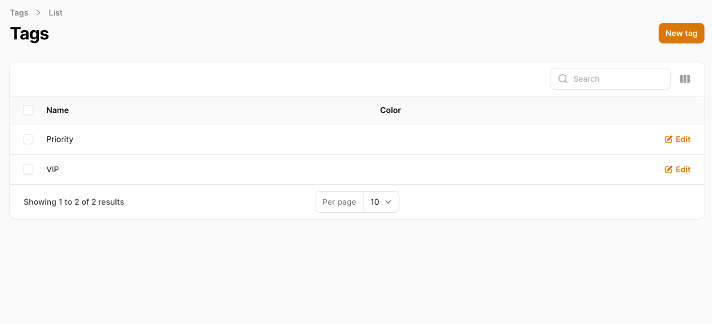
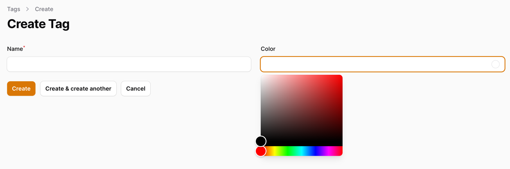
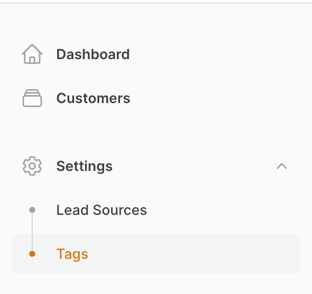

It's standard for companies to mark some clients as `priority` or `VIP` via specific tags. This can be achieved by a single column on the Customers table. Still, we will try implementing a more flexible solution - Tags table.

// @todo add image

Adding a specific color label will help us mark clients and make them stand out in the list. For that, we will need:

- `id`
- `name`
- `color`

Let's get started!

---

## Creating Tags Database

Let's start with our migration:

**Migration**
```php
Schema::create('tags', function (Blueprint $table) {
    $table->id();
    $table->string('name');
    $table->string('color')->nullable();
    $table->timestamps();
});
```

Since we know that our Customers can have more than one Tag, we will create a pivot table:

**Migration**
```php
use App\Models\Customer;
use App\Models\Tag;

// ...

Schema::create('customer_tag', function (Blueprint $table) {
    $table->foreignIdFor(Customer::class)->constrained();
    $table->foreignIdFor(Tag::class)->constrained();
});
```

Then, fill out the model:

**app/Models/Tag.php**
```php
use Illuminate\Database\Eloquent\Model;
use Illuminate\Database\Eloquent\Relations\BelongsToMany;

class Tag extends Model
{
    protected $fillable = ['name', 'color'];

    public function customers(): BelongsToMany
    {
        return $this->belongsToMany(Customer::class);
    }
}
```

Now that we have our database ready, we can create a few Tag seeds:

**database/seeders/DatabaseSeeder.php**
```php
use App\Models\Tag;

// ...

public function run(): void
{
    // ...
    
    $tags = [
        'Priority',
        'VIP'
    ];

    foreach ($tags as $tag) {
        Tag::create(['name' => $tag]);
    }
}
```

Running migrations and seeds:

```bash
php artisan migrate:fresh --seed
```

Should now give us a few tags in the database:


Finally, we can add a relationship to our Customer model:

**app/Models/Customer.php**
```php
use Illuminate\Database\Eloquent\Relations\BelongsToMany;

// ...

public function tags(): BelongsToMany
{
    return $this->belongsToMany(Tag::class);
}

// ...
```

---

## Creating Tags Resource

Let's create a new resource for our Tags:

```bash
php artisan make:filament-resource Tag
```

Once all the files are created, we can visit this page in our browser:



And we should check our Create form:


And while it works, we can instantly see an issue - no color picker. Let's fix that:

**app/Filament/Resources/TagResource.php**
```php
// ...

public static function form(Form $form): Form
{
    return $form
        ->schema([
            Forms\Components\TextInput::make('name')
                ->required()
                ->maxLength(255),
            Forms\Components\TextInput::make('color')// [tl! --]
                ->maxLength(255),// [tl! --]
            Forms\Components\ColorPicker::make('color')// [tl! ++]
        ]);
}
// ...
```

Now, if we visit our Create form, we should see a color picker:



And, of course, we should view that color in our list:

**app/Filament/Resources/TagResource.php**
```php
// ...

public static function table(Table $table): Table
{
    return $table
        ->columns([
            Tables\Columns\TextColumn::make('name')
                ->searchable(),
            Tables\Columns\TextColumn::make('color')// [tl! --]
            Tables\Columns\ColorColumn::make('color')// [tl! ++]
                ->searchable(),
            Tables\Columns\TextColumn::make('created_at')
                ->dateTime()
                ->sortable()
                ->toggleable(isToggledHiddenByDefault: true),
            Tables\Columns\TextColumn::make('updated_at')
                ->dateTime()
                ->sortable()
                ->toggleable(isToggledHiddenByDefault: true),
        ])
        ->filters([
            //
        ])
        ->actions([
            Tables\Actions\EditAction::make(),
        ])
        ->bulkActions([
            Tables\Actions\BulkActionGroup::make([
                Tables\Actions\DeleteBulkAction::make(),
            ]),
        ]);
}

// ...
```

Which should give us:


Then, of course, we should secure our Tag deletion so that we don't delete a Tag that's in use:

**app/Filament/Resources/TagResource.php**
```php
public static function table(Table $table): Table
{
    return $table
        ->columns([
            // ...
        ])
        ->filters([
            //
        ])
        ->actions([
            Tables\Actions\EditAction::make(),
            Tables\Actions\DeleteAction::make()// [tl! add:start]
                ->action(function ($data, $record) {
                    if ($record->customers()->count() > 0) {
                        Notification::make()
                            ->danger()
                            ->title('Tag is in use')
                            ->body('Tag is in use by customers.')
                            ->send();

                        return;
                    }

                    Notification::make()
                        ->success()
                        ->title('Tag deleted')
                        ->body('Tag has been deleted.')
                        ->send();

                    $record->delete();
                })// [tl! add:end]
        ])
        ->bulkActions([
            // 
        ]);
}
// ...
```

Last, we should move it to the settings dropdown:

**app/Filament/Resources/TagResource.php**
```php
class TagResource extends Resource
{
    protected static ?string $model = Tag::class;

    protected static ?string $navigationGroup = 'Settings';// [tl! ++]
    protected static ?string $navigationIcon = 'heroicon-o-rectangle-stack';// [tl! --]
    
    // ...
}
```

Loading the page, we should see it in the dropdown:



---

## Modifying Customers Resource

Now that we have our Tags resource in Filament, we can modify our Customer to use Tags:

Here's what we will need to do:

- Add a multi-select field to the Customer form
- Add labels after the Customer name in the list

Let's start with the form:

**app/Filament/Resources/CustomerResource.php**
```php
// ...

public static function form(Form $form): Form
{
    return $form
        ->schema([
            Forms\Components\TextInput::make('first_name')
                ->maxLength(255),
            Forms\Components\TextInput::make('last_name')
                ->maxLength(255),
            Forms\Components\TextInput::make('email')
                ->email()
                ->maxLength(255),
            Forms\Components\TextInput::make('phone_number')
                ->maxLength(255),
            Forms\Components\Textarea::make('description')
                ->maxLength(65535)
                ->columnSpanFull(),
            Forms\Components\Select::make('lead_source_id')
                ->relationship('leadSource', 'name'),
            Forms\Components\Select::make('tags')
                ->relationship('tags', 'name')
                ->multiple(),
        ]);
}

// ...
```

This should have added a multi-select field to our form that allows us to select multiple tags like this:


Next, we need to display it. But this is tricky since we need to render HTML next to our Customer name. For that, we will create a custom view:

**resources/views/customer/tagsList.blade.php**
```blade
@foreach($tags as $tag)
    <div class="fi-badge flex items-center justify-center gap-x-1 rounded-md text-xs font-medium ring-1 ring-inset px-1.5 min-w-[theme(spacing.5)] py-0.5 tracking-tight"
         style="background: {{ $tag->color }}; display: inline-block;">
        <span class="grid">
            <span class="truncate">{{ $tag->name }}</span>
        </span>
    </div>
@endforeach
```

This view accepts a `$tags` list and simply displays a nice button colored with tag color via inline styles. To use this view, we need to modify our CustomerResource:

**app/Filament/Resources/CustomerResource.php**
```php
// ...

public static function table(Table $table): Table
{
    return $table
        ->columns([
            Tables\Columns\TextColumn::make('first_name')
                ->label('Name')
                ->formatStateUsing(function ($record) {// [tl! remove:start]
                    return $record->first_name . ' ' . $record->last_name;
                })// [tl! remove:end]
                ->formatStateUsing(function ($record) {// [tl! add:start]
                    $tagsList = view('customer.tagsList', ['tags' => $record->tags])->render();

                    return $record->first_name . ' ' . $record->last_name . ' ' . $tagsList;
                })
                ->html()// [tl! add:end]
                ->searchable(['first_name', 'last_name']),
            // ...
        ])
        // ...
        ->bulkActions([
            Tables\Actions\BulkActionGroup::make([
                Tables\Actions\DeleteBulkAction::make(),
            ]),
        ]);
}

// ...
```

Take a good look at this line of code:

```php
$tagsList = view('customer.tagsList', ['tags' => $record->tags])->render();
```

Here, we are loading a view with tags and calling `->render()` at the end of the line. This renders the Blade file into an HTML string that we can use in our column. By doing this and adding `->html()` to our column, we get the following result:


Our tags now have colors - red for `Priority` and no color for `VIP` (since we didn't specify one). 

---

That's it for this lesson. Next time, we will add Pipeline Stages to take our Customers through the sales process.
