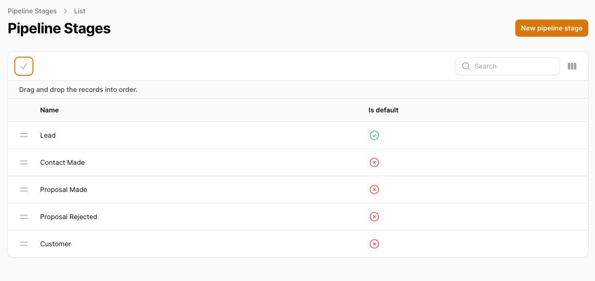
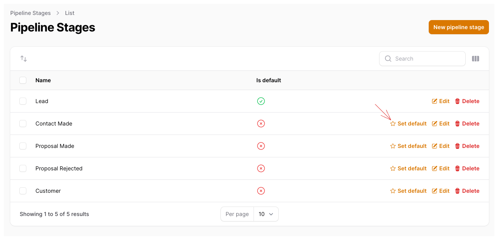
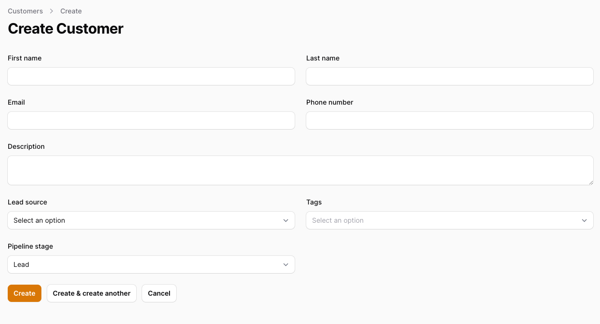
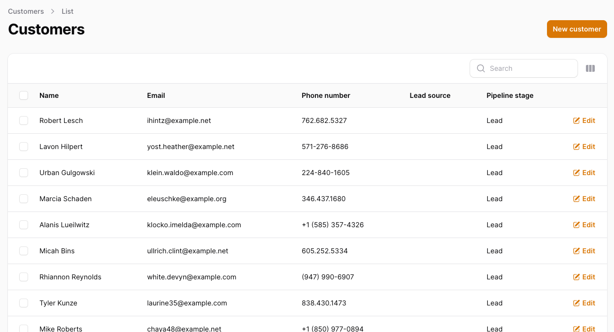

Next up, each of our Customers has to go in a Pipeline to advance from one status to another. For example, we start at `Contact Made` and then progress to `Meeting Scheduled`. To do this, we need to create a new resource Pipeline Stages:


- `id`
- `name`
- `position` - Order of the stages
- `is_default`

This will be seeded by default workflow but can be changed by admins to suit their needs.

---

## Creating Pipeline Stages Database

Let's start with our migration:

**Migration**
```php
Schema::create('pipeline_stages', function (Blueprint $table) {
    $table->id();
    $table->string('name');
    $table->integer('position');
    $table->boolean('is_default')->default(false);
    $table->timestamps();
});
```

Then, we need to create a model:

**app/Models/PipelineStage.php**
```php
use Illuminate\Database\Eloquent\Model;
use Illuminate\Database\Eloquent\Relations\HasMany;

class PipelineStage extends Model
{
    protected $fillable = [
        'name',
        'position',
        'is_default',
    ];

    public function customers(): HasMany
    {
        return $this->hasMany(Customer::class);
    }
}
```

Next, we will make sure that we have some Default data in our database:

**database/seeders/DatabaseSeeder.php**
```php
public function run(): void
{
    User::factory()->create([
        'name' => 'Test Admin',
        'email' => 'admin@admin.com',
    ]);

    Customer::factory()// [tl! remove:start]
        ->count(10)
        ->create();// [tl! remove:end]

    $leadSources = [
        'Website',
        'Online AD',
        'Twitter',
        'LinkedIn',
        'Webinar',
        'Trade Show',
        'Referral',
    ];

    foreach ($leadSources as $leadSource) {
        LeadSource::create(['name' => $leadSource]);
    }

    $tags = [
        'Priority',
        'VIP'
    ];

    foreach ($tags as $tag) {
        Tag::create(['name' => $tag]);
    }
    
    $pipelineStages = [// [tl! add:start]
        [
            'name' => 'Lead',
            'position' => 1,
            'is_default' => true,
        ],
        [
            'name' => 'Contact Made',
            'position' => 2,
        ],
        [
            'name' => 'Proposal Made',
            'position' => 3,
        ],
        [
            'name' => 'Proposal Rejected',
            'position' => 4,
        ],
        [
            'name' => 'Customer',
            'position' => 5,
        ]
    ];

    foreach ($pipelineStages as $stage) {
        PipelineStage::create($stage);
    }

    $defaultPipelineStage = PipelineStage::where('is_default', true)->first()->id;
    Customer::factory()->count(10)->create([
        'pipeline_stage_id' => $defaultPipelineStage,
    ]);// [tl! add:end]
}
```

One thing to note here is that we have moved our Customer factory to the end of the seeder so that we can assign a default pipeline stage to each customer.

Lastly, we want to add a new field to our Customer table and model:

**Migration**
```php
use App\Models\PipelineStage;

// ...

Schema::table('customers', function (Blueprint $table) {
    $table->foreignIdFor(PipelineStage::class)->nullable()->constrained();
});
```

And our Model:

**app/Models/Customer.php**
```php
// ...

protected $fillable = [
    'first_name',
    'last_name',
    'email',
    'phone_number',
    'description',
    'lead_source_id',
    'pipeline_stage_id'// [tl! ++]
];

// ...

public function pipelineStage(): BelongsTo
{
    return $this->belongsTo(PipelineStage::class);
}
```


Running migrations and seeds:

```bash
php artisan migrate:fresh --seed
```

Should now give us the default Pipeline Stages in the database:


We will see that each of our Customers has a default Pipeline Stage assigned to them:


---

## Creating Pipeline Stages Resource

Let's create a new resource for our Pipeline Stages:

```bash
php artisan make:filament-resource PipelineStage --generate
```

Once all the files are created, we can visit this page in our browser:


Next, we need to make some modifications to our resource:

- Move it to Settings dropdown
- Add reorder functionality to our table
- Remove the position column from the table
- Remove position and is_default from the create/edit forms
- Add the ability to change the default Pipeline Stage
- Add a check to make sure that we are not deleting a used Pipeline Stage

Let's start with the Navigation:

**app/Filament/Resources/PipelineStageResource.php**
```php
class PipelineStageResource extends Resource
{
    protected static ?string $model = PipelineStage::class;

    protected static ?string $navigationIcon = 'heroicon-o-rectangle-stack';// [tl! --]
    protected static ?string $navigationGroup = 'Settings';// [tl! ++]
 
    // ...
}
```

Then we can work on our form:

**app/Filament/Resources/PipelineStageResource.php**
```php
// ...

public static function form(Form $form): Form
{
    return $form
        ->schema([
            Forms\Components\TextInput::make('name')
                ->required()
                ->maxLength(255),
            Forms\Components\TextInput::make('position')// [tl! remove:start]
                ->required()
                ->numeric(),
            Forms\Components\Toggle::make('is_default')
                ->required(),// [tl! remove:end]
        ]);
}

// ...
```

This change will remove the unnecessary fields from our form:


But now we have a problem - how do we set the next position for our Pipeline Stage? We can do this by modifying the creation data:

**app/Filament/Resources/PipelineStageResource/Pages/CreatePipelineStage.php**
```php
// ...

protected function mutateFormDataBeforeCreate(array $data): array
{
    $data['position'] = PipelineStage::max('position') + 1;

    return $data;
}

// ...
```

This will automatically set the next position for our Pipeline Stage on creation.

Last, we can work on our table:

**app/Filament/Resources/PipelineStageResource.php**
```php
use Filament\Notifications\Notification;

// ...

public static function table(Table $table): Table
{
    return $table
        ->columns([
            Tables\Columns\TextColumn::make('name')
                ->searchable(),
            Tables\Columns\TextColumn::make('position')// [tl! remove:start]
                ->numeric()
                ->sortable(),// [tl! remove:end]
            Tables\Columns\IconColumn::make('is_default')
                ->boolean(),
            Tables\Columns\TextColumn::make('created_at')
                ->dateTime()
                ->sortable()
                ->toggleable(isToggledHiddenByDefault: true),
            Tables\Columns\TextColumn::make('updated_at')
                ->dateTime()
                ->sortable()
                ->toggleable(isToggledHiddenByDefault: true),
        ])
        ->defaultSort('position')// [tl! ++]
        ->reorderable('position')// [tl! ++]
        ->filters([
            //
        ])
        ->actions([
            Tables\Actions\Action::make('Set Default')// [tl! add:start]
                ->icon('heroicon-o-star')
                ->hidden(fn($record) => $record->is_default)
                ->requiresConfirmation(function (Tables\Actions\Action $action, $record) {
                    $action->modalDescription('Are you sure you want to set this as the default pipeline stage?');
                    $action->modalHeading('Set "' . $record->name . '" as Default');

                    return $action;
                })
                ->action(function (PipelineStage $record) {
                    PipelineStage::where('is_default', true)->update(['is_default' => false]);

                    $record->is_default = true;
                    $record->save();
                }),// [tl! add:end]
            Tables\Actions\EditAction::make(),
            Tables\Actions\DeleteAction::make()// [tl! add:start]
                ->action(function ($data, $record) {
                    if ($record->customers()->count() > 0) {
                        Notification::make()
                            ->danger()
                            ->title('Pipeline Stage is in use')
                            ->body('Pipeline Stage is in use by customers.')
                            ->send();

                        return;
                    }

                    Notification::make()
                        ->success()
                        ->title('Pipeline Stage deleted')
                        ->body('Pipeline Stage has been deleted.')
                        ->send();

                    $record->delete();
                })// [tl! add:end]
        ])
        ->bulkActions([
            Tables\Actions\BulkActionGroup::make([
                Tables\Actions\DeleteBulkAction::make(),
            ]),
        ]);
}

// ...
```

Loading the page, we will see a new reorder button here:


This will open a new view where we can reorder our Pipeline Stages:



Last, we can mark a Pipeline Stage as default by clicking on the `Set Default` button:



That's it. At this stage, we are done with our Pipeline Stages resource.

---

## Modifying Customer Resource

Our Customer needs to be associated with a Pipeline Stage, so let's add a new field to our resource:

**app/Filament/Resources/CustomerResource.php**
```php
use App\Models\PipelineStage;

// ...

public static function form(Form $form): Form
{
    return $form
        ->schema([
            // ...
            Forms\Components\Select::make('tags')
                ->relationship('tags', 'name')
                ->multiple(),
            Forms\Components\Select::make('pipeline_stage_id')// [tl! add:start]
                ->relationship('pipelineStage', 'name', function ($query) {
                    // It is important to order by position to display the correct order
                    $query->orderBy('position', 'asc');
                })
                // We are setting the default value to the default Pipeline Stage
                ->default(PipelineStage::where('is_default', true)->first()?->id),// [tl! add:end]
        ]);
}

// ...
```

This will add a new field to our form:



Last, we can add a new column to our table:

**app/Filament/Resources/CustomerResource.php**
```php
// ...

public static function table(Table $table): Table
{
    return $table
        ->columns([
            Tables\Columns\TextColumn::make('first_name')
                ->label('Name')
                ->formatStateUsing(function ($record) {
                    $tagsList = view('customer.tagsList', ['tags' => $record->tags])->render();

                    return $record->first_name . ' ' . $record->last_name . ' ' . $tagsList;
                })
                ->html()
                ->searchable(['first_name', 'last_name']),
            Tables\Columns\TextColumn::make('email')
                ->searchable(),
            Tables\Columns\TextColumn::make('phone_number')
                ->searchable(),
            Tables\Columns\TextColumn::make('leadSource.name'),
            Tables\Columns\TextColumn::make('pipelineStage.name'),// [tl! ++]
            // ...
        ])
        ->filters([
            // ... 
        ])
        ->actions([
            // ...
        ])
        ->bulkActions([
            // ...
        ]);
}

// ...
```

This will add a new column to our table:



That's it - our Customers can now be assigned to a Pipeline Stage.
